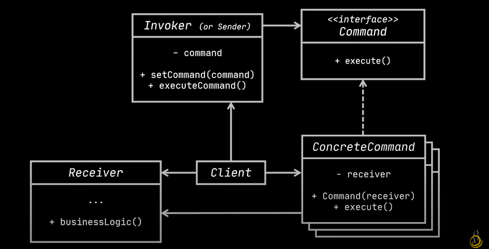
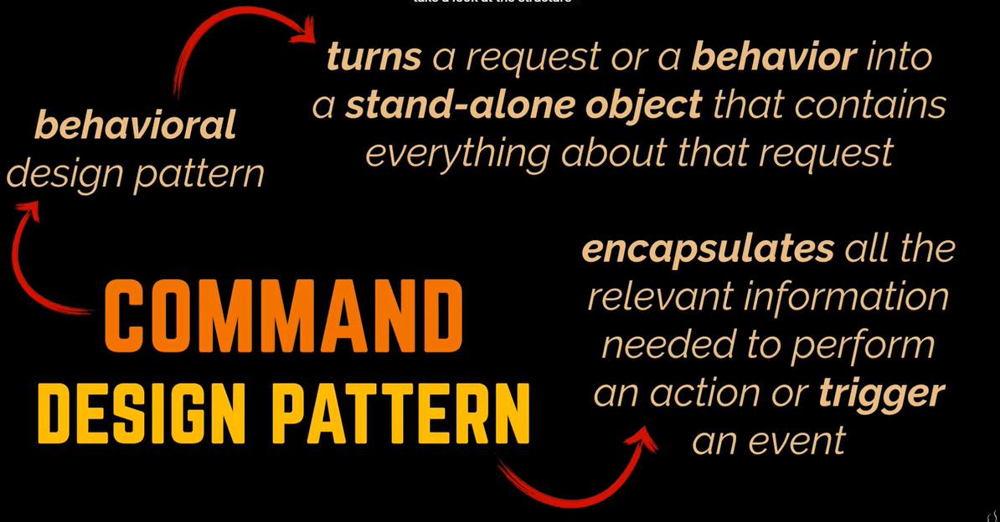

# Command Pattern: In-Depth Notes

## Also known as: Action, Transaction

## Intent

The Command pattern turns a request into a stand-alone object containing all information about the request. This allows you to:

*   Pass requests as method arguments.
*   Delay or queue a request's execution.
*   Support undoable operations.

## Problem

Text editor with toolbar buttons. Each button should perform a different action. Naive approach: create subclasses of `Button` for each action.

*   **Enormous number of subclasses.**
*   Risk of breaking code in subclasses when modifying the base `Button` class.
*   Duplication of code for operations invoked from multiple places (toolbar, context menu, keyboard shortcut).
*   GUI code becomes dependent on volatile business logic code.

## Solution

Apply the Command pattern to separate concerns and reduce coupling.

1.  **Encapsulate Requests:** Extract all request details (object, method, arguments) into a separate `Command` class with a single `execute()` method.
2.  **Decouple GUI and Business Logic:** GUI objects trigger commands, which handle the details of the request. GUI objects don't need to know which business logic object will receive the request.
3.  **Command Interface:** Define a common interface (e.g., `execute()`) for all commands, allowing you to use various commands with the same request sender.
4.  **Request Parameters:** Configure the command object with the necessary request parameters (either pre-configured or obtained by the command itself).

## Real-World Analogy: Restaurant Order

*   **You:** GUI layer (initiating the request).
*   **Waiter:** Command object (encapsulates the request).
*   **Order Paper:** Specific command object (e.g., "Steak, medium-rare").
*   **Kitchen/Chef:** Receiver (performs the business logic).

## Structure

1.  **Sender (Invoker):** Responsible for initiating requests. Holds a reference to a `Command` object. Triggers the command instead of sending the request directly to the receiver. Doesn't create the command object. Gets the command from the client.
2.  **Command Interface:** Declares a single `execute()` method.
3.  **Concrete Commands:** Implement the `Command` interface. Pass the call to one of the business logic objects (the Receiver). Can merge with the Receiver for simplicity. Parameters required to execute the method on the Receiver are declared as fields in the concrete command. Can be immutable (only initialized via the constructor).
4.  **Receiver:** Contains the business logic. Can be any object. The command handles how the request is passed to the receiver; the receiver does the work.
5.  **Client:** Creates and configures concrete command objects. Passes all request parameters (including a Receiver instance) into the command's constructor. Associates commands with senders.

## Pseudocode Example: Undoable Operations in Text Editor

1.  Commands that change the editor's state make a backup copy of the editor's state before execution.
2.  Executed commands are placed into a command history (stack) along with the backup copy.
3.  To revert, take the most recent command from history, read the backup, and restore the editor's state.

Client code (GUI elements, command history) works with commands via the command interface, allowing new commands to be added without breaking existing code.

## Applicability

*   **Parametrize Objects with Operations:** Turn method calls into standalone objects.
*   **Queue Operations:** Serialize commands to delay execution, queue them, or execute them remotely.
*   **Implement Reversible Operations (Undo/Redo):** Store command objects and application state for reverting actions.

## How to Implement

1.  Declare the command interface (`execute()`).
2.  Extract requests into concrete command classes.
3.  Identify sender classes and add fields for storing commands.
4.  Change senders to execute the command instead of sending requests directly.
5.  The client initializes objects in the following order:

    *   Create receivers.
    *   Create commands and associate them with receivers.
    *   Create senders and associate them with commands.

## Pros and Cons

**Pros:**

*   **Single Responsibility Principle:** Decouple classes that invoke operations from classes that perform them.
*   **Open/Closed Principle:** Introduce new commands without breaking existing client code.
*   **Undo/Redo:** Implement reversible operations.
*   **Deferred Execution:** Implement deferred execution of operations.
*   **Composite Commands:** Assemble a set of simple commands into a complex one.

**Cons:**

*   Code becomes more complicated due to the new layer between senders and receivers.

## Relations with Other Patterns

*   **Chain of Responsibility, Command, Mediator, Observer:** Address ways of connecting senders and receivers.
*   **Chain of Responsibility:** Handlers can be implemented as Commands (execute operations over the same context) or the request itself can be a Command (execute the same operation in different contexts).
*   **Command and Memento:** Use together for "undo" (Commands perform operations, Mementos save state).
*   **Command and Strategy:** Similar in that they parameterize an object with some action, but have different intents. Command turns any operation into an object for deferred execution, queueing, etc. Strategy describes different ways of doing the same thing.
*   **Prototype:** Can help when saving copies of Commands into history.
*   **Visitor:** Can be treated as a powerful version of the Command pattern, able to execute operations over various objects of different classes.

