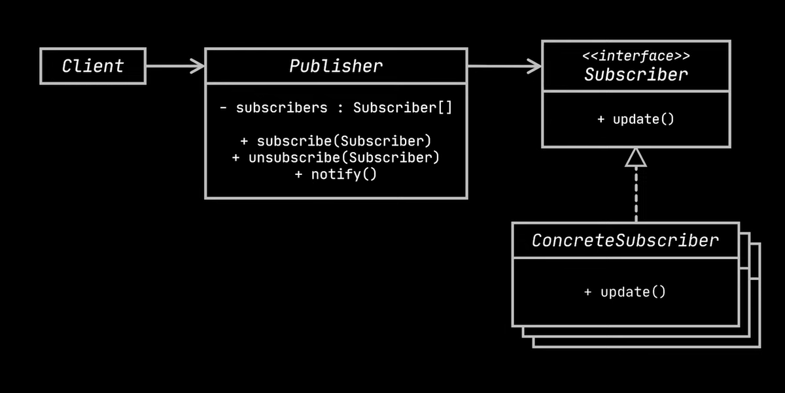
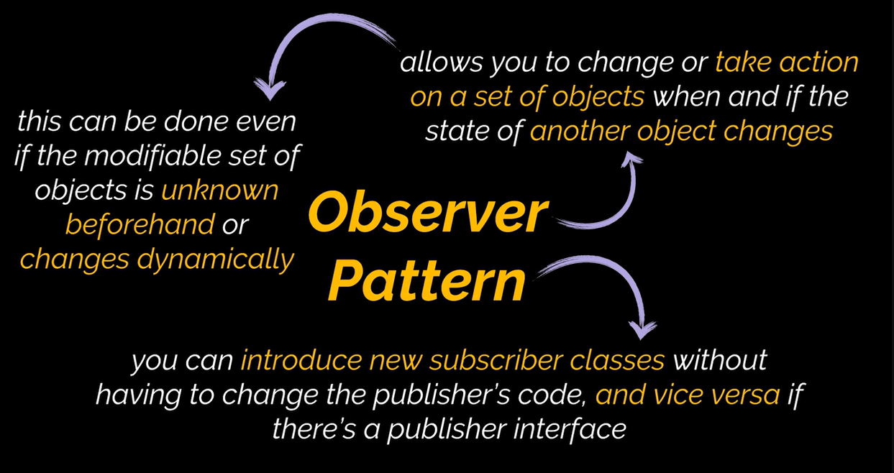

## Observer Design Pattern

**Definition:** The Observer pattern defines a one-to-many dependency between objects, so that when one object (the subject, or publisher) changes state, all its dependents (observers, or subscribers) are notified and updated automatically.

**Problem:**

*   How to notify multiple objects about state changes in another object.
*   Avoiding tight coupling between the publisher and its subscribers.
*   Handling situations where the set of subscribers is unknown or changes dynamically.

**Solution:**

*   Introduce a subscription mechanism to the publisher class, allowing individual objects to subscribe to or unsubscribe from a stream of events.
*   Subscribers implement a common interface with a notification method (e.g., `update()`).
*   The publisher maintains a list of subscribers and iterates through it, calling the notification method on each subscriber when an event occurs.
*   Communication happens via the subscriber interface, decoupling the publisher from concrete subscriber classes.

**Real-World Analogy:**

Magazine/Newspaper Subscriptions: The publisher sends new issues to subscribers, who can subscribe or unsubscribe at any time.

**Structure:**

*   **Publisher:** Maintains a list of subscribers and notifies them of events. Has methods to add/remove subscribers.
*   **Subscriber Interface:** Defines the notification method (e.g., `update()`) that subscribers must implement.
*   **Concrete Subscribers:** Implement the subscriber interface and define how they respond to notifications.
*   **Client:** Creates publisher and subscriber objects and registers them with each other.

**Applicability:**

*   When changes to one object's state require changes in other objects, and the set of objects is unknown or dynamic.
*   In graphical user interfaces (e.g., custom buttons notifying clients when pressed).
*   When objects need to observe others for a limited time or in specific cases.

**How to Implement:**

1.  Identify the publisher and subscriber roles in your business logic.
2.  Declare the subscriber interface with an `update()` method.
3.  Declare the publisher interface with methods for adding/removing subscribers.
4.  Create a concrete publisher class that maintains the subscription list and notifies subscribers.
5.  Implement concrete subscriber classes with specific actions for the `update()` method.
6.  In the client, create publisher and subscriber objects and register them with each other.

**Pros:**

*   **Open/Closed Principle:** New subscriber classes can be added without changing the publisher's code.
*   **Loose Coupling:** Publisher and subscribers are independent.
*   **Dynamic Relationships:** Subscribers can register and unregister at runtime.

**Cons:**

*   Subscribers are notified in a random order.
*   Can lead to unexpected updates if not carefully designed.

