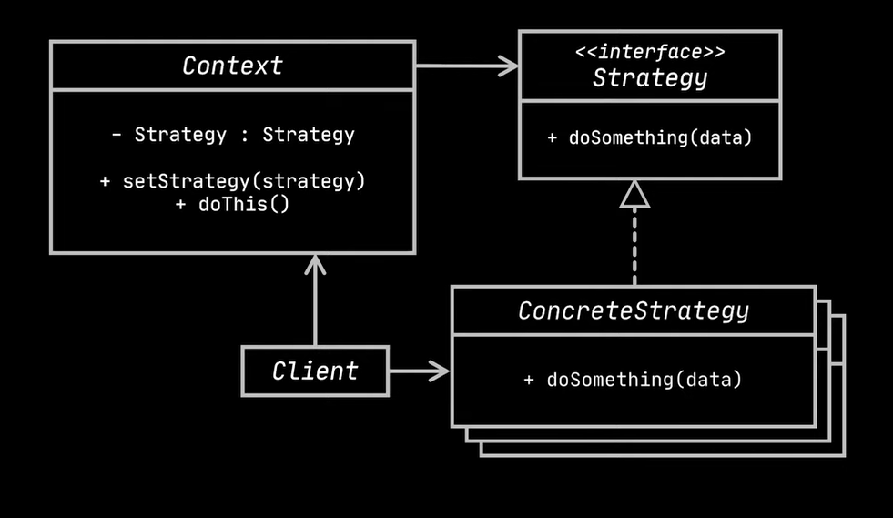
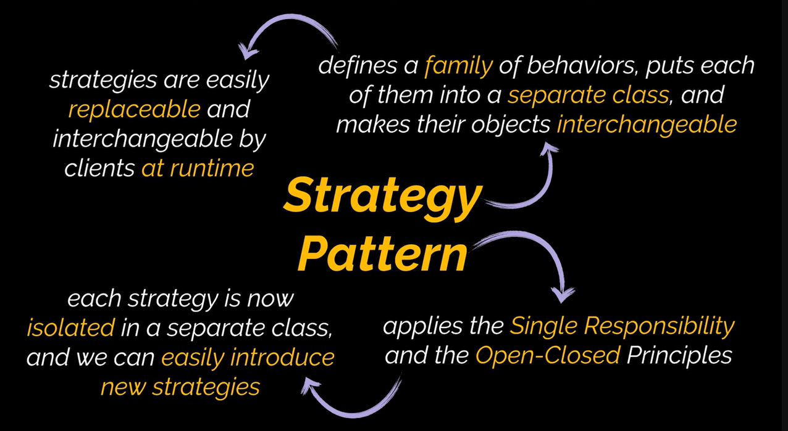

# Strategy Design Pattern

## Intent

Define a family of algorithms, encapsulate each one into a separate class, and make their objects interchangeable. Allows varying the algorithm independently from clients.

## Problem

Imagine a navigation app that plans routes using different algorithms (roads, walking, public transport, cycling). As you add more algorithms, the main class becomes bloated, hard to maintain, and prone to merge conflicts. Changing one algorithm affects the entire class.

## Solution

Extract each algorithm into a separate class (strategy). The original class (context) holds a reference to one of these strategies and delegates the work to it. Clients pass the desired strategy to the context, allowing runtime switching of algorithms.

### Route Planning Example

*   Each routing algorithm becomes a class with a `buildRoute` method.
*   The navigator class (context) holds a reference to a routing strategy.
*   Clients (UI buttons) can switch the active routing strategy at runtime.

## Real-World Analogy

Getting to the airport: You can use different strategies (bus, taxi, bicycle) depending on factors like budget and time.

## Structure

*   **Context:** Maintains a reference to a `ConcreteStrategy`. Communicates with the strategy through the `Strategy` interface.
*   **Strategy Interface:** Common interface for all concrete strategies. Declares a method for the context to execute a strategy.
*   **Concrete Strategies:** Implement different variations of an algorithm.
*   **Client:** Creates a specific `Strategy` object and passes it to the `Context`. The `Context` exposes a setter for clients to replace the strategy at runtime.

## Applicability

*   Use when you want to switch between different variants of an algorithm at runtime.
*   Use when you have many similar classes that differ only in how they execute a certain behavior.
*   Use to isolate the business logic of a class from the implementation details of algorithms.
*   Use when your class has a massive conditional statement to switch between different algorithm variants.

## How to Implement

1.  Identify the algorithm that changes frequently (or the large conditional statement).
2.  Declare the `Strategy` interface common to all algorithm variants.
3.  Extract each algorithm into its own class implementing the `Strategy` interface.
4.  Add a field for storing a `Strategy` object to the context class. Provide a setter for replacing the `Strategy`.
5.  Clients associate the context with a suitable `Strategy` object.

## Pros and Cons

**Pros:**

*   Swap algorithms at runtime.
*   Isolate algorithm implementation details.
*   Replace inheritance with composition.
*   Open/Closed Principle: Introduce new strategies without modifying the context.

**Cons:**

*   Overkill if you have few algorithms that rarely change.
*   Clients must be aware of the differences between strategies to select the appropriate one.
*   Many modern languages have functional type support.

## Key Considerations

*   Consider using anonymous functions (lambdas) if you have only a few simple algorithms.
*   Balance the complexity of the Strategy pattern with the benefits of flexibility and maintainability.

