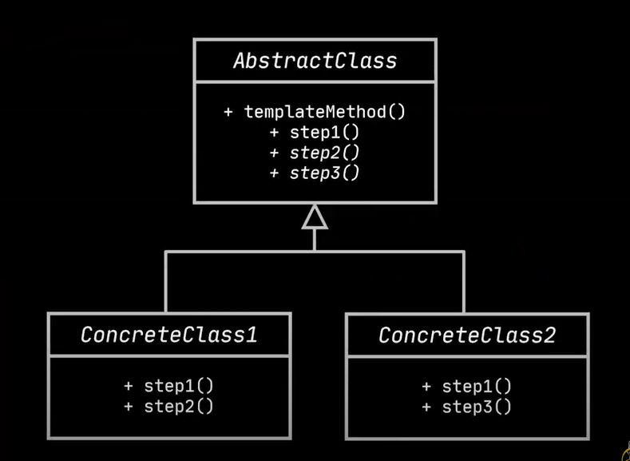
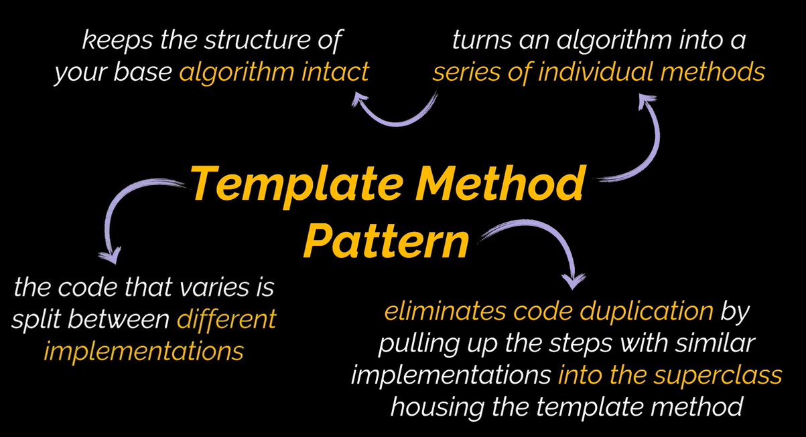

## Template Method Design Pattern

**Intent:**

Define the skeleton of an algorithm in the superclass but let subclasses override specific steps of the algorithm without changing its structure.

**Problem:**

*   Code duplication across classes that implement similar algorithms with variations.
*   Client code contains conditionals to handle different classes implementing the same algorithm, leading to inflexibility and complexity.

**Solution:**

1.  **Break down the algorithm into a series of steps.**  Turn these steps into methods.
2.  **Create a Template Method:** A method in the base class that defines the order of execution of these steps.
3.  **Abstract Steps:** Steps that *must* be implemented by subclasses (declared as abstract methods in the base class).
4.  **Optional Steps:** Steps with default implementations in the base class that subclasses *can* override if needed.
5.  **Hooks:** Optional steps with empty bodies in the base class.  Subclasses can override them to inject custom behavior at specific points in the algorithm.

**Real-World Analogy:**

*   **Mass Housing Construction:**  A standard architectural plan with customizable elements (extension points) to fit individual client needs (e.g., foundation, walls, plumbing).

**Structure:**

*   **Abstract Class:**
    *   Defines the template method (the main algorithm).
    *   Declares abstract methods for required steps.
    *   Provides default implementations for optional steps.
    *   May include hooks.
*   **Concrete Class:**
    *   Implements the abstract methods defined in the abstract class.
    *   Overrides optional methods (and hooks) to customize specific steps of the algorithm.

**Applicability:**

*   When you want to allow clients to extend *specific steps* of an algorithm, but not its overall structure.
*   When you have multiple classes with nearly identical algorithms that differ in a few key steps.  This allows you to reduce code duplication.

**How to Implement:**

1.  **Analyze the Algorithm:** Break it down into distinct steps.
2.  **Create the Abstract Base Class:**
    *   Define the `templateMethod()` which calls the steps in the correct order.  Consider making it `final` to prevent overriding.
    *   Declare abstract methods for required steps.
    *   Provide default implementations for optional steps.
    *   Consider adding hooks.
3.  **Create Concrete Subclasses:**  Implement the abstract methods, and optionally override the non-abstract ones (including hooks).

**Pros:**

*   **Controlled Extensibility:**  Clients can only customize specific parts of the algorithm.
*   **Code Reusability:**  Shared code is placed in the superclass, reducing duplication.
*   **Algorithm Structure Enforcement:**  The template method guarantees the algorithm's overall structure.

**Cons:**

*   **Limited Flexibility:** Clients are constrained by the algorithm's skeleton.
*   **Liskov Substitution Principle Violation:** Overriding a default step implementation in a subclass can violate this principle.
*   **Maintenance Complexity:**  Template methods with many steps can become difficult to maintain.

