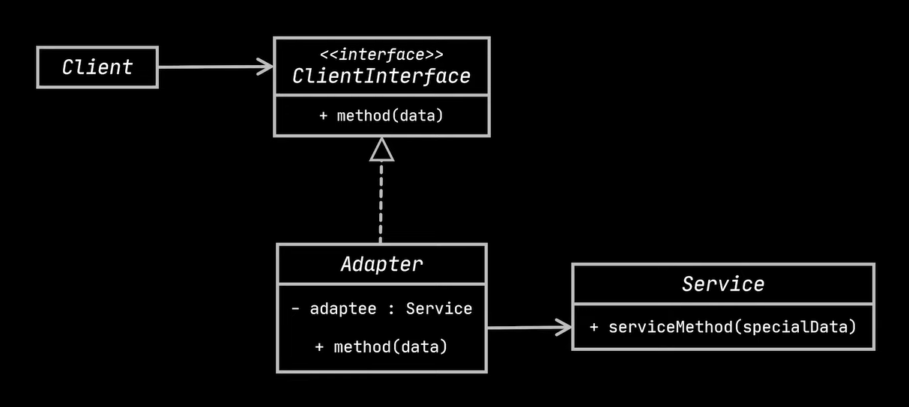
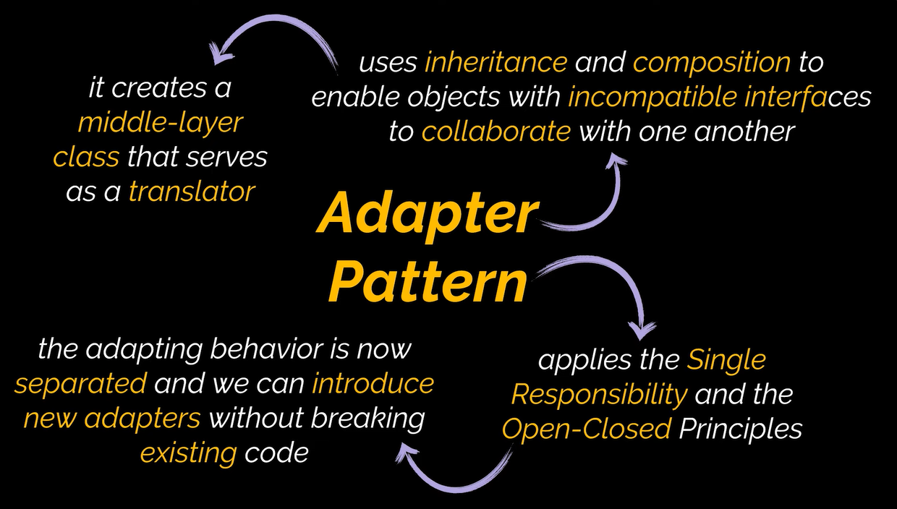

# Adapter Design Pattern (Wrapper)

**Intent:** Allows objects with incompatible interfaces to collaborate. It acts as a translator between two incompatible interfaces.

**Problem:**

*   You have a class (Service) with an interface that doesn't match what your client code expects.
*   You want to use an existing class but its interface isn't compatible with your current system.
*   You need to integrate a 3rd-party library with a different data format or API.

**Solution:**

*   Create an Adapter class that:
    *   Implements the interface the client expects (Client Interface).
    *   Contains a reference to the Service object (the class with the incompatible interface).
    *   Translates calls from the client interface into calls that the Service object can understand (data format conversion, method renaming, argument reordering, etc.).

**Analogy:**

*   Power adapter: Converts the voltage and plug type to fit different electrical standards.
*   Suitcase for international travel: Has different compartments for different items like clothing, toiletries, and documents.

**Structure:**

Two main implementations:

*   **Object Adapter (Preferred):** Uses composition.  The adapter implements the client interface and *wraps* the service object.  More flexible.

    *   **Client:** The class that contains the existing business logic and needs to interact with the Service.
    *   **Client Interface:** Defines the protocol for interacting with the Client.
    *   **Service:** The class with the incompatible interface (e.g., a 3rd-party library).
    *   **Adapter:** Implements the Client Interface, holds a reference to the Service, and translates calls.

*   **Class Adapter:** Uses inheritance (multiple inheritance required). The adapter inherits from both the client interface and the service class. Less common and less flexible.

**Applicability:**

*   When you want to use an existing class, but its interface doesn't match.
*   When you want to create reusable classes that work with unanticipated classes, that is, classes that don't necessarily share a common interface.
*   When you need to integrate several existing subclasses that lack a common functionality, but you can't add it to a common superclass.  (Similar to Decorator Pattern in this case).

**How to Implement:**

1.  Identify the incompatible interfaces (Client Interface and Service).
2.  Declare the Client Interface.
3.  Create the Adapter class, implementing the Client Interface.
4.  In the Adapter, create a field to hold a reference to the Service object.
5.  Implement the Client Interface methods in the Adapter. Delegate the real work to the Service object, handling the interface/data conversion.

**Pros:**

*   **Single Responsibility Principle:** Separates interface/data conversion from business logic.
*   **Open/Closed Principle:**  Add new adapters without modifying client code.
*   Allows you to reuse existing classes that might not have been designed to work together.

**Cons:**

*   Increases code complexity due to new classes and interfaces.
*   Sometimes, modifying the Service class directly might be simpler.

