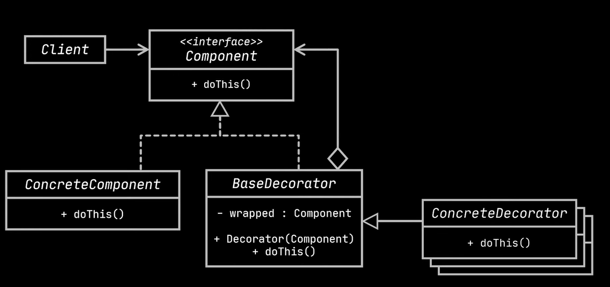

# Decorator Design Pattern (Wrapper)

**Intent:** Dynamically attach new behaviors to objects by wrapping them in special decorator objects that contain the behaviors. Add responsibilities to objects without modifying their structure.

**Problem:**

*   You need to add responsibilities to individual objects dynamically.
*   Inheritance is not flexible enough because it's static and can lead to a combinatorial explosion of subclasses when combining features.
*   You want to add behavior to an object without modifying its class directly.
*   You need to extend an object's behavior at runtime.

**Solution:**

*   Use a "wrapper" object (the decorator) that:
    *   Implements the same interface as the wrapped object (Component Interface). This ensures the decorator is interchangeable with the core component.
    *   Holds a reference to the wrapped object.
    *   Delegates calls to the wrapped object.
    *   Adds new behavior *before* and/or *after* the call to the wrapped object.
*   Chain multiple decorators together to combine behaviors.

**Analogy:**

*   Wearing clothes:  A sweater, a jacket, and a raincoat are decorators that add warmth and protection without changing your fundamental "being."
*   Coffee: Base coffee can be decorated with milk, sugar, chocolate, etc., each adding a new "behavior" to the coffee.

**Structure:**

*   **Component:** Defines the common interface for both Concrete Components and Decorators. (e.g., `Notifier` in the example)
*   **Concrete Component:** The original object being decorated.  Implements the basic behavior. (e.g., Base `Notifier` class)
*   **Decorator (Base Decorator):** Implements the Component interface. Holds a reference to the wrapped Component. Delegates calls to the wrapped Component.  (e.g.,  Abstract Decorator class)
*   **Concrete Decorator:** Adds new behavior before or after the call to the wrapped Component. Extends the Base Decorator.  (e.g., `SMSNotifier`, `FacebookNotifier`, `SlackNotifier`)
*   **Client:** Responsible for creating the decorator stack. Works with objects through the Component interface.

**Applicability:**

*   When you need to add responsibilities to objects dynamically and transparently.
*   When inheritance is not feasible (e.g., due to `final` classes, or combinatorial explosion of subclasses).
*   When you want to divide a complex responsibility into several smaller, simpler classes.
*   To be able to add behaviors at runtime (e.g., enable/disable features based on user preferences or configuration).

**How to Implement:**

1.  Create a Component interface defining the common methods.
2.  Create a Concrete Component class that implements the Component interface.
3.  Create a Base Decorator class that implements the Component interface and holds a reference to a Component object.
4.  Create Concrete Decorator classes that extend the Base Decorator and add specific behaviors before or after calling the wrapped Component's methods.
5.  The client code composes the decorators dynamically.

**Pros:**

*   **Open/Closed Principle:** Extend object behavior without modifying existing classes.
*   **Single Responsibility Principle:** Decompose complex behaviors into smaller classes.
*   More flexible than inheritance for adding responsibilities.
*   Behaviors can be added or removed at runtime.

**Cons:**

*   Can lead to many small classes, increasing complexity.
*   The order of decorators can be important, and managing that order can be challenging.
*   Debugging can be more difficult due to the decorator chain.
*   Can be difficult to remove a specific decorator from the middle of the chain.

