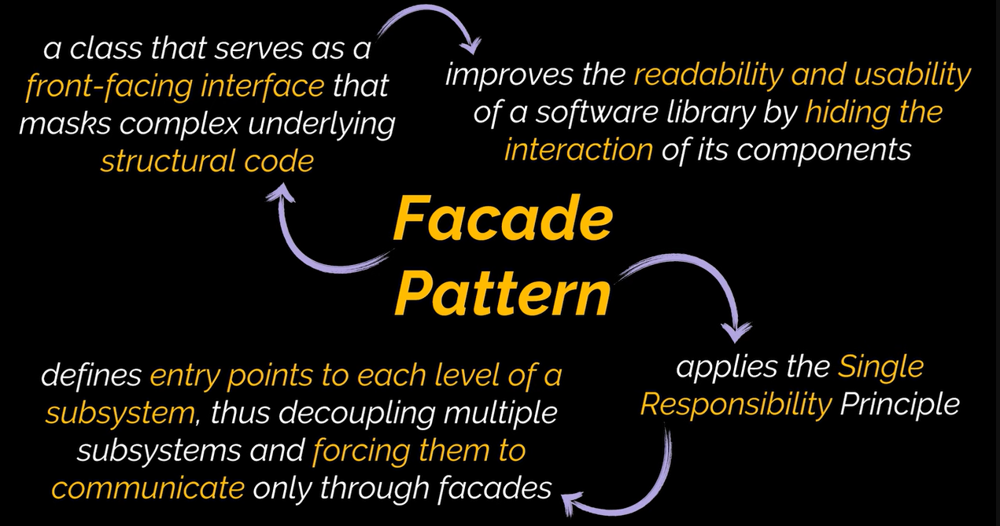

## Facade Design Pattern

**Intent:** Provides a simplified interface to a complex subsystem (library, framework, set of classes).

**Problem:**

*   Interacting directly with complex subsystems involves initializing multiple objects, managing dependencies, and executing methods in the correct order.
*   This leads to tight coupling between client code and subsystem implementation details, making code harder to understand and maintain.

**Solution:**

*   A **Facade** is a class that offers a simplified, higher-level interface to a complex subsystem.
*   It encapsulates the complexity, providing only the features clients typically need.

**Real-World Analogy:**

*   **Phone Order:**  When you place an order by phone, the operator acts as a facade. They simplify the interaction with the shop's ordering system, payment gateways, and delivery services. You don't need to know about each department; you interact with the operator.

**Structure:**

*   **Facade:** Provides the simplified interface to the subsystem.  It knows how to direct requests and manage the subsystem's components.
*   **Additional Facades:** Can be created to prevent a single facade from becoming overly complex with unrelated features. They can be used by clients and other facades.
*   **Complex Subsystem:** A collection of classes with complex interactions. Subsystem classes are unaware of the facade.

**Applicability:**

*   **Simplified Interface:**  When you need a limited but straightforward interface to a complex subsystem.
*   **Subsystem Layering:** To structure a subsystem into layers, defining entry points to each layer via facades. Reduces coupling between subsystems.

**How to Implement:**

1.  **Identify Simplifiable Interface:** Determine if a simpler interface than the existing subsystem's is possible and useful. Focus on reducing dependencies and making client code independent.
2.  **Create Facade Class:** Declare and implement the simplified interface in a new facade class.  Redirect calls to appropriate subsystem objects.
3.  **Initialization & Lifecycle:**  The facade is responsible for initializing the subsystem and managing its lifecycle (unless the client code already does).
4.  **Use Facade Exclusively:**  Ensure client code communicates with the subsystem *only* through the facade.
5.  **Refactor as Needed:** If the facade becomes too large, consider extracting parts of its behavior into refined facades.

**Pros:**

*   **Isolates Complexity:** Shields client code from the complexity of a subsystem.
*   **Reduces Dependencies:** Promotes loose coupling between the client and the subsystem.
*   **Improved Readability:** Makes client code cleaner and easier to understand.

**Cons:**

*   **Potential God Object:**  A facade can become a "god object" if it's coupled to all classes of the application. (Requires careful design to avoid)

