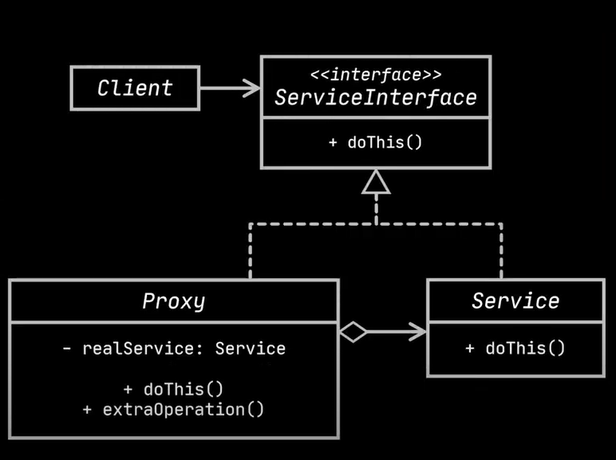
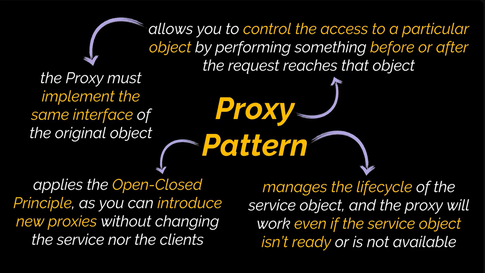

## Proxy Design Pattern

**Intent:**

Provide a substitute or placeholder for another object to control access and perform actions before or after a request.

**Problem:**

*   Need to control access to an object (e.g., for lazy initialization, access control, remote access, logging, caching, smart references).
*   Want to avoid modifying the original object's class directly.
*   Want to avoid code duplication for tasks like lazy initialization.

**Solution:**

*   Create a Proxy class with the same interface as the original Service object.
*   Clients interact with the Proxy instead of the Service.
*   The Proxy handles requests and can:
    *   Create the real Service object (lazy initialization).
    *   Apply access control rules.
    *   Forward requests to a remote server.
    *   Log requests.
    *   Cache results.
    *   Manage the lifecycle of the Service.

**Real-World Analogy:**

*   Credit card as a proxy for a bank account or cash.

**Structure:**

*   **Service Interface:** Declares the interface that both the Service and Proxy implement.
*   **Service:** The actual object providing the business logic.
*   **Proxy:**  Holds a reference to the Service, implements the Service Interface, and adds extra behavior (access control, caching, etc.).

**Applicability:**

*   **Lazy Initialization (Virtual Proxy):** Create a heavy object only when needed.
*   **Access Control (Protection Proxy):** Restrict access to certain clients.
*   **Remote Execution (Remote Proxy):** Access a service on a remote server.
*   **Logging Proxy:**  Log requests to the service.
*   **Caching Proxy:** Cache results of requests.
*   **Smart Reference:** Manage the lifecycle of a heavyweight object.

**How to Implement:**

1.  Create a service interface if one doesn't exist.
2.  Create the Proxy class, implementing the service interface and holding a reference to the service.
3.  Implement proxy methods, delegating to the service after performing pre/post-processing.
4.  Consider a creation method to decide whether to return a proxy or the real service.
5.  Implement lazy initialization.

**Pros:**

*   Control access to the service object.
*   Manage the lifecycle of the service.
*   Work even if the service isn't ready or available.
*   Open/Closed Principle: Add new proxies without changing service or clients.

**Cons:**

*   Increased code complexity due to new classes.
*   Potential delays in response from the service.## Proxy Design Pattern

**Intent:**

Provide a substitute or placeholder for another object to control access and perform actions before or after a request.

**Problem:**

*   Need to control access to an object (e.g., for lazy initialization, access control, remote access, logging, caching, smart references).
*   Want to avoid modifying the original object's class directly.
*   Want to avoid code duplication for tasks like lazy initialization.

**Solution:**

*   Create a Proxy class with the same interface as the original Service object.
*   Clients interact with the Proxy instead of the Service.
*   The Proxy handles requests and can:
    *   Create the real Service object (lazy initialization).
    *   Apply access control rules.
    *   Forward requests to a remote server.
    *   Log requests.
    *   Cache results.
    *   Manage the lifecycle of the Service.

**Real-World Analogy:**

*   Credit card as a proxy for a bank account or cash.

**Structure:**

*   **Service Interface:** Declares the interface that both the Service and Proxy implement.
*   **Service:** The actual object providing the business logic.
*   **Proxy:**  Holds a reference to the Service, implements the Service Interface, and adds extra behavior (access control, caching, etc.).

**Applicability:**

*   **Lazy Initialization (Virtual Proxy):** Create a heavy object only when needed.
*   **Access Control (Protection Proxy):** Restrict access to certain clients.
*   **Remote Execution (Remote Proxy):** Access a service on a remote server.
*   **Logging Proxy:**  Log requests to the service.
*   **Caching Proxy:** Cache results of requests.
*   **Smart Reference:** Manage the lifecycle of a heavyweight object.

**How to Implement:**

1.  Create a service interface if one doesn't exist.
2.  Create the Proxy class, implementing the service interface and holding a reference to the service.
3.  Implement proxy methods, delegating to the service after performing pre/post-processing.
4.  Consider a creation method to decide whether to return a proxy or the real service.
5.  Implement lazy initialization.

**Pros:**

*   Control access to the service object.
*   Manage the lifecycle of the service.
*   Work even if the service isn't ready or available.
*   Open/Closed Principle: Add new proxies without changing service or clients.

**Cons:**

*   Increased code complexity due to new classes.
*   Potential delays in response from the service.

