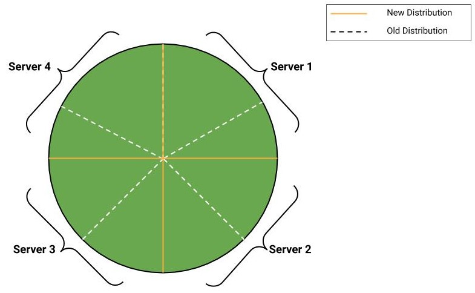

# Load Balancing ( Hashing)

Hashing is crucial for building scalable systems.

## 1. The Server-Client Model

*   **Scenario:** You have a program running on a computer (a server).
*   **Demand:** Users want to use this program remotely (e.g., through a mobile app) and are willing to pay for it.
*   **Interaction:**
    *   The client sends a *request*.
    *   The server processes the request (e.g., facial recognition).
    *   The server sends back a *response* (e.g., the image with a mustache).

## 2. Load Balancing Problem

*   **Scenario:** The program becomes popular, resulting in thousands of requests that a single server cannot handle.
*   **Solution:** Add more servers.
*   **Problem:** How do you distribute the incoming requests across these multiple servers (load balancing)? The goal is even load distribution.

## 3. Simple Hashing Approach

*   **Goal:** Evenly distribute the workload across N servers.
*   **Mechanism:**
    1.  Each request has a unique ID (request ID).
    2.  The request ID is hashed (H(request ID)).  Assume the hash function generates uniformly random outputs.
    3.  The hash value is used to determine the server: `server = H(request ID) mod N`

## 4. Example

*   **Scenario:** Four servers (S0, S1, S2, S3).
*   **Request IDs & Hash Values:**
    *   H(R1) = 3; 3 mod 4 = 3  -> R1 goes to S3
    *   H(R2) = 15; 15 mod 4 = 3 -> R2 goes to S3
    *   H(R3) = 12; 12 mod 4 = 0  -> R3 goes to S0
*   **Result:**  If the hash function is uniformly random, the load should be evenly distributed across the servers. Each server should have approximately X/N load, where X is the total number of requests. The load factor is 1/N.

## 5. The Problem with Adding Servers (Traditional Hashing)

*   **Scenario:** Due to increased demand, you need to add another server (S4).
*   **Problem:**  The `mod N` operation changes. Requests that were previously mapped to specific servers are now mapped to different servers.
*   **Impact:** Existing caching becomes useless (see next section).

## 6. Illustration with a Pie Chart

*   Initially, with 4 servers, each server handles 25% of the requests.  Adding a 5th server means each should handle 20%.  With simple mod hashing, this results in significant re-mapping. One server may lose buckets, one may add buckets.
*   Example Changes in Assigned Buckets:
    * server 1 : -10 buckets changed
    * server 2 :+10 buckets changed
*   **Worst Case:**  The cost of the change can be equal to the entire sort space (e.g. there can be *100% remapping*).

## 7. The Importance of Caching & "Sticky" Sessions

*   **Reasoning:**  Request IDs often contain information about the user (e.g., user ID). Hashing the user ID will consistently map the user to the same server.
*   **Benefit:** If the user is always sent to the same server, profile information (e.g., from a database) can be stored in a local cache on that server. This improves performance.
*   **Consequence of Server Reassignment (Without Consistent Hashing):** If a user is suddenly assigned to a different server, the cached information is useless.
*   **Goal:** Minimize the disruption of server assignments when servers are added or removed.

## 8. Desired Properties of an Improved Hashing Scheme

*   When adding a server, only a *small* number of existing requests should be re-mapped to the new server.
*   Minimize the overall change in server assignments.
*    In a new pie chart (5 servers), what you would like to do is
    take a little from this first server, so that is, that is this bit,
    take a little from the second server, take a little from the third server,
    and take a little from the fourth server such that the,
    the sum of these areas is going to be 20%.
*   **Conclusion:**  Standard hashing is insufficient. More advanced approaches (like consistent hashing) are needed.