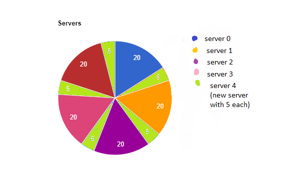

# Consistent Hashing: Minimizing Disruption

Consistent hashing aims to minimize the impact of adding or removing servers on existing data and caching, building on the basic hashing approach.

## 1. The Problem: Data Disruption with Simple Hashing

*   Adding or removing servers in a traditional hashing setup causes widespread remapping of requests.
*   This invalidates cached data, leading to performance degradation.

## 2. Hashing onto a Ring

*   **Key Idea:** Instead of mapping hash values to an array, map them to a ring (a circular space).  This ring represents the entire hash space (0 to M-1).
*   **Process:**
    1.  Hash the request ID: H(request ID). Map the hash value to a point on the ring.
    2.  Hash the server IDs: H(server ID).  Map each server to a point on the ring.
    3.  For each request, traverse the ring clockwise from the request's point until you encounter the first server. That server handles the request.

## 3. Example

*   Imagine four servers (SS1, SS2, SS3, SS4) mapped to different points on the ring.
*   Requests are also mapped to points on the ring.
*   Each request is served by the server found by moving clockwise around the ring from the request's position.

## 4. Uniform Distribution & Load Balancing

*   Because hashes are assumed to be uniformly random, the distance between servers and requests on the ring is expected to be uniform.
*   This results in a roughly even load distribution across the servers (load factor ~ 1/N).

## 5. Adding a Server (Consistent Hashing)

*   Adding a new server (SS5) to the ring only affects the requests in the region between the new server and the server immediately clockwise from it.
*   Those requests are now served by the new server.
*   **Benefit:** The change in load on existing servers is minimized.

## 6. Removing a Server (Consistent Hashing)

*   If a server (e.g., SS1) is removed, requests that were being served by it are now handled by the next server clockwise around the ring.
*   The change is localized.

## 7. The Skewed Distribution Problem (Practical Concerns)

*   **Theoretical Ideal:** Uniform load distribution.
*   **Reality:** With a small number of servers, the distribution of requests on the ring might not be perfectly uniform, leading to some servers being overloaded.

## 8. Solution: Virtual Servers & Multiple Hash Functions

*   **Key Idea:**  Increase the number of points on the ring to improve load distribution.
*   **Mechanism:**
    *   Create *virtual servers*.  This doesn't mean physically adding more servers.
    *   Use multiple hash functions (K hash functions) to map each server to K different points on the ring.
*   **Example:** If K=3, each server has 3 points on the ring.  Instead of 4 servers you get 12 points which leads to better performance.
*   **Benefits:**
    *   Reduces the likelihood of a single server becoming overloaded.
    *   Smooths out the load distribution.  For example, K = log N or log M
    *   When server load gets high.
*   **Adding or Removing:** When a server is removed, you need to remove K points and clockwise assign to nearest servers.

## 9. Impact of Virtual Servers on Load Changes

*   With virtual servers, when a server is added or removed, the load change is distributed more evenly across the system.
*   Each server takes a small amount of load from multiple servers, or gives a small amount of load to multiple servers.
*   It is more likely that one is going to take load from this server,
    some load from this server, some load from this server, and some load from this server.

## 10. Applications of Consistent Hashing

*   Load balancing in distributed systems
*   Web caches
*   Databases
*   Gives flexibility and efficiency.