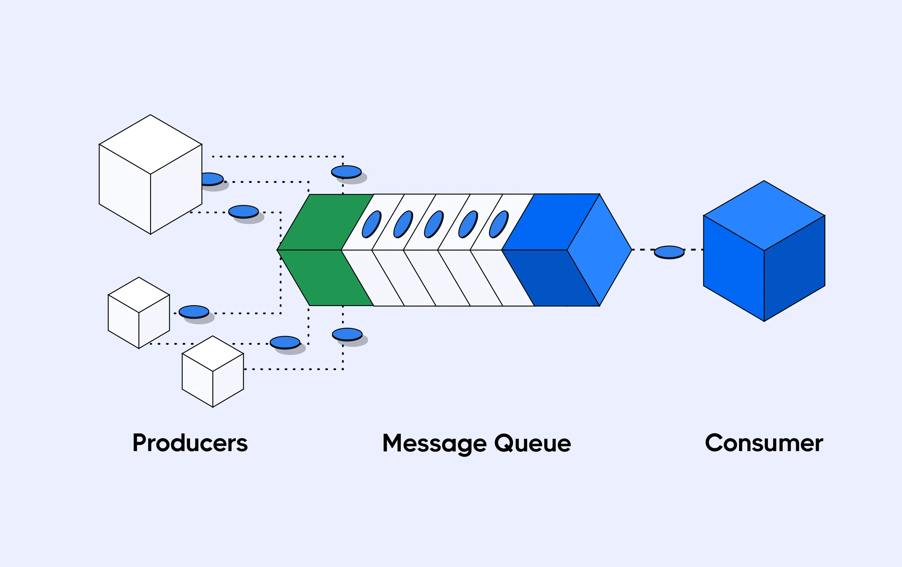

# Improved Messaging Queue Notes (Pizza Shop Example)

## Asynchronous Order Processing
A traditional pizza shop maintains a queue of incoming orders, giving immediate confirmation of their order ("Please sit down," "Come back later"). The queue allows clients to perform other tasks and prioritize requests.

## Scaling and Data Persistence
As a growing pizza shop, consider implementing takeaway and delivery services with the help of pizza shops (1, 2, 3). Should a pizza shop (3) go down due to a power outage, delivery services should be redirected to pizza shops (1,2). In that way, the pizza shop can save money. To save the orders you need to maintain persistence in your data. This leads to saving data in database and not maintaining it in memory.

## Servers, Databases, and Order Processing
A server (1-4) manages incoming orders from the pizza shop and stores order number (3, 8, 20, 9, 11) in the database. If a server (3) that serves order numbers (9, 11) crashes, the remaining servers need to reroute their services. This can be done with a notifier that connects to each server every 15 seconds. When a server doesn't respond it's assumed that the server is dead. Then the databases distributes those order to the three remaining servers.

## Heartbeat Mechanism & Notification
The problem to solve is that there might be some duplication. This is solved with load balancing and a heartbeat. This can be found with consistent hashing.

## Task Queue
The Task Queue contains the features of assignment or notification, load balancing, a heartbeat and persistence into one thing.
This contains multiple strategies and they are encapsulated in a task queue.

## Examples of Messaging Queues
* RabbitMQ
* ZeroMQ
* Java Messaging Service (JMS)
* Amazon SQS

These concepts are fundamental to system design.