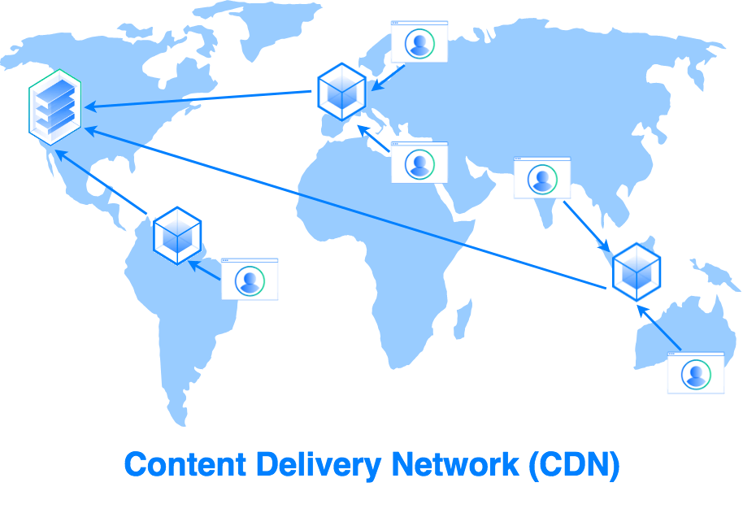

# Content Delivery Networks (CDNs)

This explanation covers Content Delivery Networks (CDNs), which are used to improve the speed and cost-effectiveness of delivering content to users.

## 1. CDN Goal: Cheaper and Faster Systems

CDNs are designed to make systems cheaper and faster.

## 2. Prerequisites

*   Caching
*   Basic understanding of distributed systems

## 3. Simple System vs CDN

*   Users connect to your website
    *   Resolve address of DNS server
    *   Get an IP address
    *   Connect to IP address
*   The page you see rendered is an HTML page
*   HTML Pages are stored on the file system
    *   Cached for performance in memory (or local storage)

## 4. Problem With a Simple System

*To get a web page takes time*
*   *Is there a single server that can serve websites to people connecting to Japan, US and India?* No.
*   If the server is in India, it will be fast for Indians but slow for Americans. If you move it central to both parties, no one will be happy.
*   May have local regulations that say data should only be displayed to that country.
    *   You can only show content in India but cannot show it in the US and Japan. Then you want some sort of local storage.
    *   US may have movies only allowed in US, not in India.

## 5. Content Distribution

*   Take the large cache connected to the server and distribute into smaller chunks. content which is relevant is stored closer to user.

## 6. CDN Benefits

*   Much faster if Americans want to connect to a local server.
*   The local server contains content relevent to user.
*   Amazon and google did studies that show if a website can be rendered quickly that people see the website as professional.
*   Local regulations can be met individually
    *   Those can be met individually in the local caches themselves and
        you're able to serve content which is
        relevant to the user

## 7. Caches are Just Servers

*   CDNs are actually servers (able to connect to IP address and hit API that is going to return response).
*   Have a file system.
*   File systems are managed by the mother server.

## 8. What CDN Solutions Provide

1.  *They have boxes in many faces close to the potential flights.*
2.  *The CDN is quite efficient at following regulatations.*
3.  *The content amation in the S yet is us make easy*
*   Integration of content with system is easy for engineer since event is triggered automatically.

## 9. Real-World Example: Amazon CloudFront

*   Cheap, reliable, easy to use.
*   Integration with Amazon S3
    *   New file gets new content to the front.
*   Most Cloud Solutions (gcp Azure) give you this.
*   Content in CDN is stack data (videos, images, files)

## 10. Definition of CDN

*   Blackbox that stores static content close to all clients. Cheap and very efficient for access to fast data.